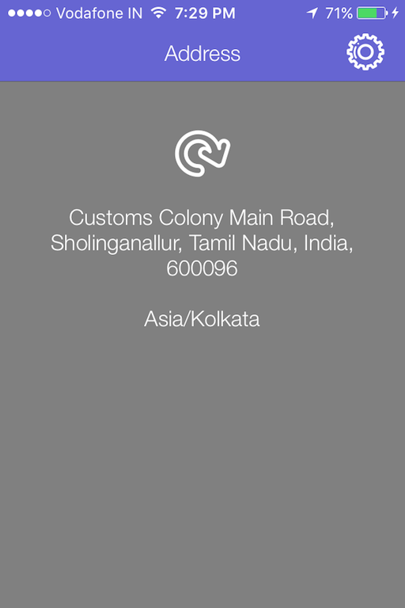

in this tutorial we will see steps for creating Todays Extension also known as a Widget. This is explained by creating an app called My Address which retrieves user’s current location and reverse geocodes in to Address. My Address App Extension (Todays Extension) shows users current address in a Widget as shown the below screenshot. The coordinate is reverse geocoded into address using Apple’s [CLGeocoder API](https://developer.apple.com/library/ios/documentation/CoreLocation/Reference/CLGeocoder_class/#//apple_ref/c/tdef/CLGeocodeCompletionHandler). 

The following topics will be covered as part of the tutorial
- Creating iOS Framework
- Integrating App and Framework
- Adding Today Extension

# Download the starter project

You should download [starter project](https://github.com/rshankras/MyAddress-Starter) to get started. The Starter app displays the latitude and longitude of user’s current location. 