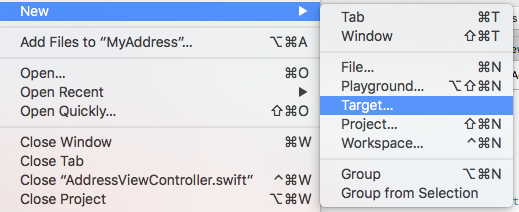
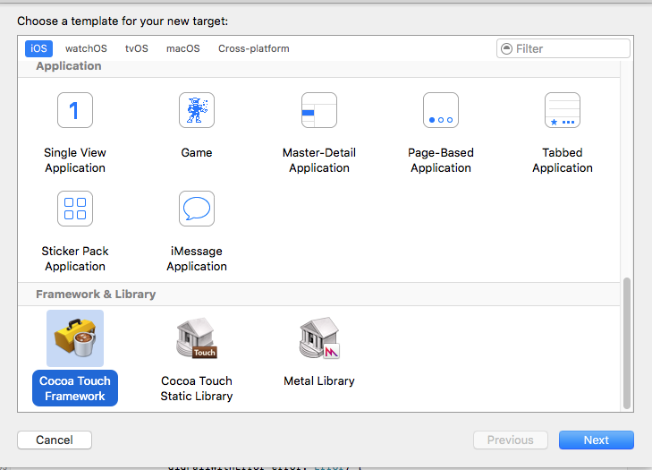
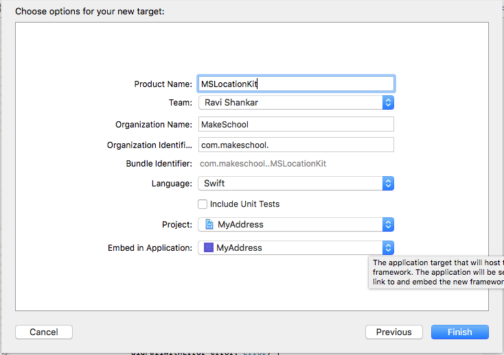
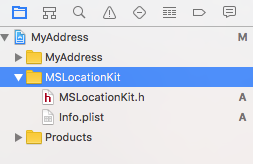
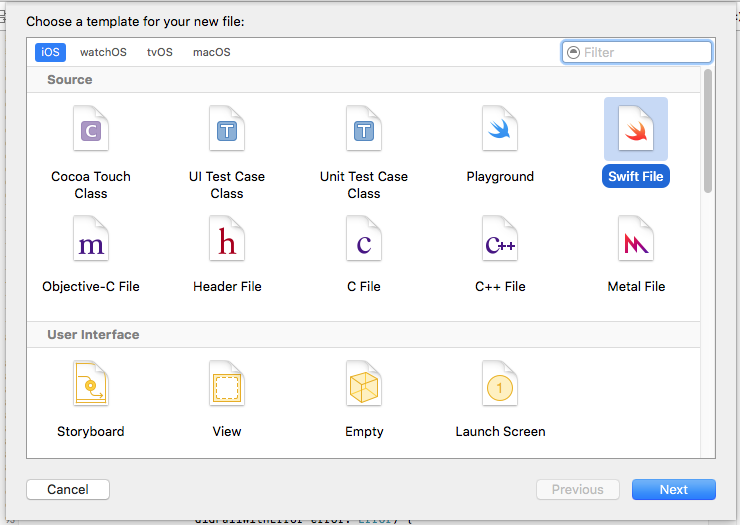

# Introduction

In this section we will see the steps for creating iOS Framework. And this framework will be used for sharing the reverse geocode functionality between App and App Extension.

# Create Framework Project

Click File menu then select New followed by Target sub menu.



Select **Cocoa Touch Framework** option under **Framework & Library** section in the template screen.



Enter the product name as **MSLocationKit** and click Finish button to create the Framework.



Xcode project navigator should now display the newly created Framework as shown below.



# MSAddress Model

Right click on **MSLocationKit** folder and select New File from the context menu. Navigate to iOS tab and select Swift File under Source section. Then enter the filename as **MSAddress** and save the file.



MSAddress model object will be used for storing address information received from ReverseGeocode API. Let us create MSAddress as a struct type and add the following piece of code to **MSAddress.swift**.


```
public struct MSAddress {
    
    public let name: String
    public let locality: String
    public let postalCode: String
    public let country: String
    public let administrativeArea: String
    public let timeZone: TimeZone
    
    public func addressBuilder(showTZ:Bool) -> String {
        var addressString = name + ", "
            + locality + ", "
            + administrativeArea + ", "
            + country + ", "
            + postalCode + "\r\n"
        if showTZ {
            addressString += "\r\n"
            addressString += timeZone.identifier
        }
        return addressString
    }
}

```

MSAddress defines all the attributes of an Address data model. It also acts as a helper function which builds address information and returns a String object. **addressBuilder** function has a boolean argument which decides whether to add the timezone information with other address attributes.

# MSLocationService

Right click on **MSLocationKit** folder then select **New File** option from the context menu. . Navigate to iOS tab and select Swift File under Source section. Enter filename as **MSLocationService** and save the file.


**MSLocationService** will have a helper function to reverse geocode location object in to address. Open **MSLocationService.swift** and add the below lines of code.

```
import CoreLocation

public class ReverseGeocoder: NSObject {

    public static func getAddress(location: CLLocation, callback: @escaping (_ myAddress:MSAddress) -> Void) {
        
        CLGeocoder().reverseGeocodeLocation(location, completionHandler: { (placemarks, error) in
            if let error = error {
                print(error)
            } else {
                if let placemarks = placemarks {
                    if let name = placemarks[0].name, let locality = placemarks[0].locality, let postalCode = placemarks[0].postalCode, let country =  placemarks[0].country, let administrativeArea = placemarks[0].administrativeArea, let timeZone = placemarks[0].timeZone {
                        
                        let address = Address(name: name, locality: locality, postalCode: postalCode, country: country, administrativeArea: administrativeArea, timeZone: timeZone)
                        
                        callback(address)
                    }
                }
            }
        })
    }
}

```

The getAddress function takes **CLLocation** object as an argument and populates address information (**MSAddress**) as a callback parameter. The function uses reverseGeocodeLocation method in CLGeocoder API to convert CLLocation in to CLPlacemark. Then CLPlacemark information is used for populating the MSAddress data model. Now to build MSLocationKit framework, use build option under Product menu in Xcode or use keyboard shortcut **(⌘ + B)**. Make sure there are no compile errors.

# Summary

In this section we have seen the steps for creating a new iOS framework that uses Apple's [CLGeocoder API](https://developer.apple.com/library/ios/documentation/CoreLocation/Reference/CLGeocoder_class/#//apple_ref/c/tdef/CLGeocodeCompletionHandler) for reverse geocoding the current location.
