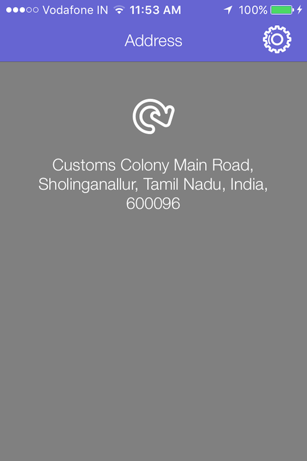

# Introduction

In this section we will see the steps for integrating the **MSLocationKit** framework with the App. MyAddress app has a Settings screen to turn On/Off the display of Time Zone and this preference will be stored in UserDefaults. 

# Update Common.swift

The timezone logic will be shared between **AddressViewController.swift** and **SettingsViewController.swift**. So we will add this functionality as part of **Common.swift**. Navigate to **Common.swift** and add the following lines of code (after the import statement)

```
let defaults = UserDefaults(suiteName: "group.makeschool.MyCurrentAddress")

func isTimeZone() -> Bool {
    var timeZone = false
    if defaults?.object(forKey: "timezone") != nil {
        timeZone = (defaults?.bool(forKey: "timezone"))!
    } else {
        timeZone = true
    }
    
    return timeZone
}

```
UserDefaults with suite name as “group.makeschool.MyCurrentAddress” is created and this will be used for storing timezone preferences. **isTimeZone** function returns a boolean based on the value stored in UserDefaults. When the app is launched for the first time, the preference is not set hence isTimeZone will return true.

# Update SettingsViewController

Navigate to IBAction **changeTZSwitch** function in **SettingsViewController.swift** then add the below line to ensure that the value change of UISwitch is stored in UserDefaults.

```
defaults?.set(sender.isOn, forKey: "timezone")

```

Then replace **viewDidLoad** method of **SettingsViewController** with the following lines

```
override func viewDidLoad() {
    super.viewDidLoad()
    tzSwitch.isOn = isTimeZone()
}

```
Now you have got a functional TimeZone switch which should retrieve the last saved value from **UserDefaults**.

#Update AddressViewController

In **AddressViewController.swift**, add a import statement at the top of the class to include **MSLocationKit**

```
import MSLocationKit

```
Then replace the didUpdateLocations method in AddressViewController with the following lines

```
func locationManager(_ manager: CLLocationManager,
                    didUpdateLocations locations: [CLLocation]) {
    if locations.count > 0 {
        performUIUpdatesOnMain {
            MSLocationService.getAddress(location: locations.first, callback: { (address) in
                self.addressLabel.text = address.addressBuilder(showTZ: isTimeZone())
            })
            self.activityIndicator.stopAnimating()
        }
            
    }
    performUIUpdatesOnMain {
        self.activityIndicator.stopAnimating()
    }
}

```

First we are passing location as an argument to getAddress method of MSLocationService. Once the location is reverse geocoded, the callback parameter will be populated with the Address information. Based on the value set for Time Zone, the **addressBuilder** function will return information with or without TimeZone detail.

# Summary

Try running the app on the simulator or any supported Device, you should see information as shown in the below screenshot.

**Address**



**Address with TimeZone**


