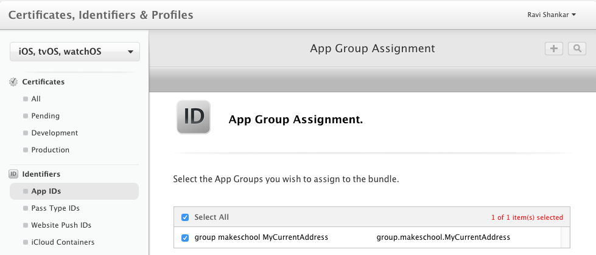

# Introduction

This section is about the changes to be done in Apple's developer portal for sharing data between the apps

# Sharing data between apps

The following steps needs to be followed to share data between the main app and app extension.

- Create unique App ID in apple developer account and make sure to enable App Groups under Services section. For creating a new App ID, use the bundle identifier from your project.

- Add the UserDefaults suite name (group.makeschool.MyCurrentAddress) to the App Groups section as a container group.

- Download and install the newly created developer profile on to your Mac.
- Select this developer profile in Xcode under Signing (Debug) and Signing (Release) section.

- Enable **App Groups** under **Capabilities** for the Project target and make sure to add the container name Under App Groups (group.makeschool.MyCurrentAddress).

# Summary

These are the developer portal related changes required for sharing data between the main app and app extension.

