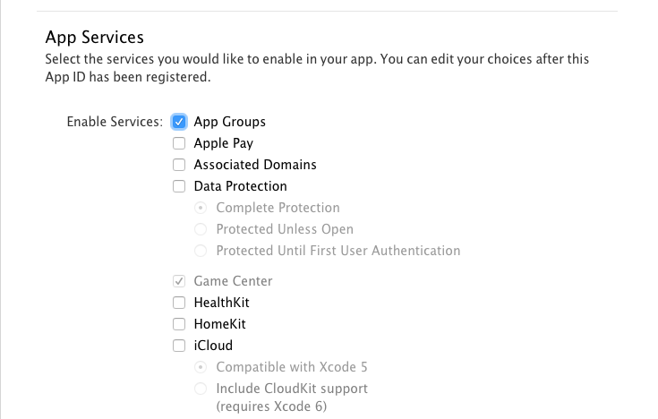
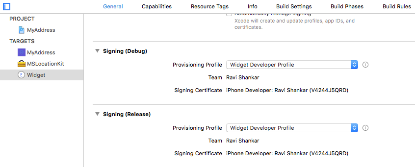
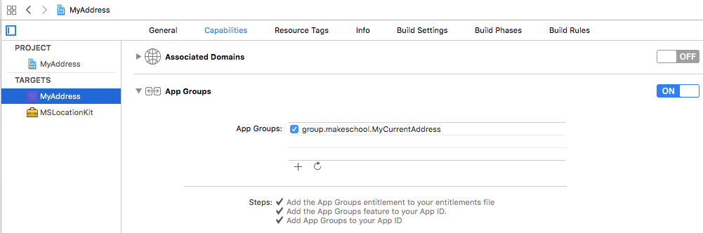

# Introduction

This section is about the changes to be done in Apple's developer portal for sharing data between the apps

# Sharing data between apps

The following steps needs to be followed to share data between the main app and app extension.

1. Create unique App ID in apple developer account and make sure to enable App Groups under Services section.

2. Add the UserDefaults suite name (group.makeschool.MyCurrentAddress) to the App Groups section as a container group.

3. Download and install the newly created developer profile on to your Mac.
4. Select this developer profile in Xcode under Signing (Debug) and Signing (Release) section.

5. Enable the App Groups under Capabilities for the Project target and make sure to add the container name Under App Groups (group.makeschool.MyCurrentAddress).

# Summary

These are the developer portal related changes required for sharing data between the main app and app extension.

