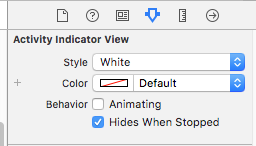

# Introduction

In this section, we will see the steps to add today extension to your project. Then steps for integrating app extension with MSLocationKit framework.

# Add New Target

Create a new target by clicking File menu followed by New then selecting **Target** from the Sub menu.


In the template screen, select **Today Extension** under **Application Extension**


Enter the product name as **Widget** and click Finish to create Today Extension target.


Select Activate option in Activate “Widget” scheme (if prompted)


# Create App ID for Today Extension

Create a new App ID for the bundle identifier matching Widget Target. This is similar to the steps followed for creating App ID for the main app.


Make sure to enable **App Groups** under **App Services**.


Select the group bundle name and assign it to App Group.


Then create a new developer provisioning profile by selecting Widget App ID.


Now download and install the Widget Provisioning profile on your Mac. 

# Update Widget Target Settings

Select the newly created widget provisioning profile for Widget target as shown in the below screenshot.


Navigate to **Capabilities** tab under Widget target and enable App Groups. Select app groups **“group.makeschool.MyCurrentAddress”** as shown in the below screenshot.


Then under **Linked Frameworks and Libraries** section add **MSLocationKit.framework**.


# UI changes for Extension

Now expand Widget folder and navigate to **MainInterface.storyboard**


Drag and drop the Activity Indicator View from object library to TodayViewController as shown below.


In the attributes inspector, change the style as White. Then mark the check box with caption as **Hides when stopped**. 



Using Assistant editor, create **IBOutlets** for ActivityIndicatorView and UILabel. Provide name as activityIndicator and addressLabel as shown in the below screenshot.


Also change the default text for the addressLabel from Hello World to Address. Constraints have been added for addressLabel hence select ActivityIndicatorView, using Align option add **Horizontally in Container** and **Vertically in Container** alignment constraints. This would ensure that the ActivityIndicatorView appears at centre of the view.


# Integrate Core Location and Framework

Navigate **TodayViewController.swift** and add the following import statements above the class declaration

```
import CoreLocation
import MSLocationKit

```

Add **setupLocationManager** function below the widgetPerformUpdate function. 

```

// MARK:- Setup CLLocationManager
    
func setupLocationManager() {
    locationManager = CLLocationManager()
    locationManager?.desiredAccuracy = kCLLocationAccuracyBest
    locationManager?.delegate = self
    locationManager?.requestWhenInUseAuthorization()
}

```

The **setupLocationManager** function, initializes the locationManager variable and sets the desired location accuracy to best. CLLocationManager delegate related functions will be handled by TodayViewController by setting locationManager?.delegate to self. Finally the **requestWhenInUseAuthorization** ensures to get the permission from user to access their current location.

In order fix **Use of unresolved identifier locationManager** error, copy the the below variable declaration after the class declaration.

```
var locationManager: CLLocationManager?

```

Xcode would now show an error message that says **cannot assign value of type TodayViewController to type CLLocationManagerDelegate**. This can be fixed by adding the following extension for TodayViewController. This extension should be added after the closing parenthesis of TodayViewController class.

```
extension TodayViewController: CLLocationManagerDelegate {
    func locationManager(_ manager: CLLocationManager, didUpdateLocations locations: [CLLocation]) {
        //
    }
    
    func locationManager(_ manager: CLLocationManager, didFailWithError error: Error) {
        //
    }
}

```

Add the following **UserDefaults** declaration between locationManager variable and IBOutlets declaration.

```

let defaults = UserDefaults(suiteName: "group.makeschool.MyCurrentAddress")

```

Now add the following lines code that were already added as part of the main app. These functions can be added after the setupLocationManager function.We have to redefine these functions under Widget target as it does not have access to main app module.

```

func isTimeZone() -> Bool {
    var timeZone = false
    if defaults?.object(forKey: "timezone") != nil {
        timeZone = (defaults?.bool(forKey: "timezone"))!
    } else {
        timeZone = true
    }
    
    return timeZone
}

func performUIUpdatesOnMain(updates: @escaping () -> Void) {
    OperationQueue.main.addOperation { 
           updates()
    }
}

```

Now replace **didUpdateLocations** and **didFailWithError** with the following lines of code. 

```

func locationManager(_ manager: CLLocationManager,
                         didUpdateLocations locations: [CLLocation]) {
        if locations.count > 0 {
            performUIUpdatesOnMain {
                MSLocationService.getAddress(location: locations.first!, callback: { (address) in
                    self.addressLabel.text = address.addressBuilder(showTZ: self.isTimeZone())
                })
                self.activityIndicator.stopAnimating()
            }
            
        }
        performUIUpdatesOnMain {
            self.activityIndicator.stopAnimating()
        }
    }

   func locationManager(_ manager: CLLocationManager,
                         didFailWithError error: Error) {
        print(error.localizedDescription)
        
        performUIUpdatesOnMain {
            self.addressLabel.text = "error retrieving location information"
            self.activityIndicator.stopAnimating()
        }
    }

Call setupLocationManager function in viewDidLoad method.

    override func viewDidLoad() {
        super.viewDidLoad()
        
        setupLocationManager()
    }

```

Then navigate to **widgetPerformUpdate** function and add the following lines of code before **completionHandler** statement.

```
 
activityIndicator.startAnimating()
locationManager?.startUpdatingLocation()

```

Finally make sure to add **Privacy - Location When In Use Usage Description** property in info.plist of widget target with some description. Now you should be able to compile and run the Todays Extension on siimulator or any supported device. This should show the reverse geocoded address as shown below.


If you see the following warning message like **Linking against a dylib which is not safe for use in application extensions:** then disable the Require Only App Extension-Safe API under Build Settings of Widget Target.


# Summary

We have seen the following as part of this tutorial 

1. Create a new framework in iOS
2. Steps for sharing data between App and App Extension
3. Add Today Extension to a Main app.


